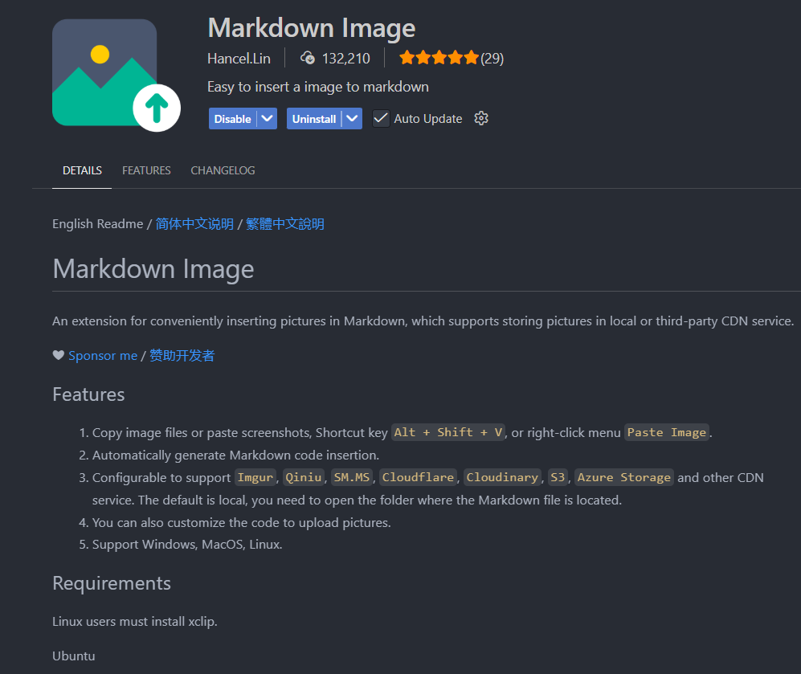
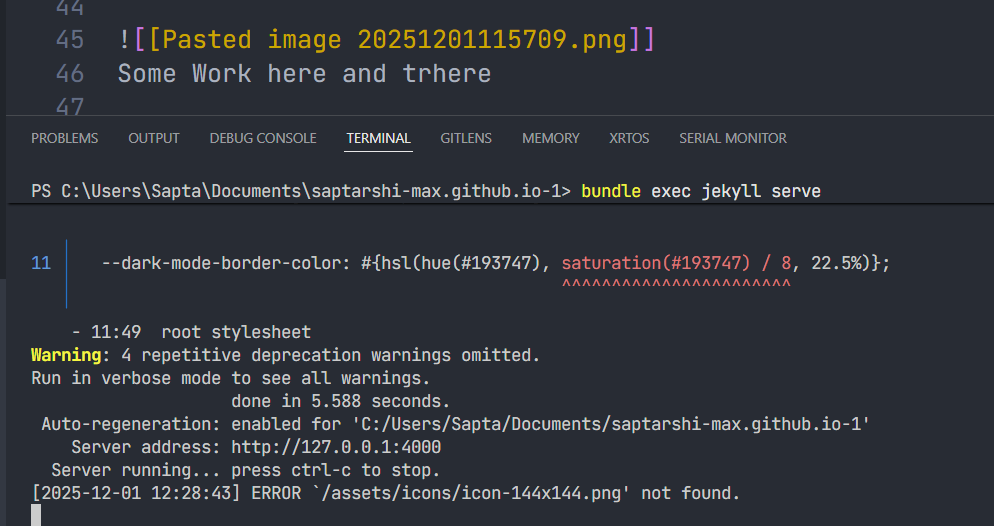

# PocoEdge - Industrial IoT Gateway

- Table of Contents
{:toc .large-only}

## Introduction 
Just to check ...
this is some texts.
This one is blog
Hello world post 
While this tutorial was written with Windows in mind, the only difference per platform is how you install Jekyll and file paths. {:.note}

![[Pasted image 20251201122507.png]]

## History

Elements of file handling in the project.

![[Pasted image 20251201122607.png]]

  

  

## What the future holds ?

![[Pasted image 20251201115709.png]]
Some Work here and trhere 

![[Pasted image 20251201121034.png]]
## Geographical and economical Challenges 
<button class="btn btn-sm btn-primary" onclick=" window.open('https://github.com/TsekNet/PowerShell-Profile','_blank')" value="View Source on Github">
  <small class="icon-github"></small> View Source on Github
</button>

